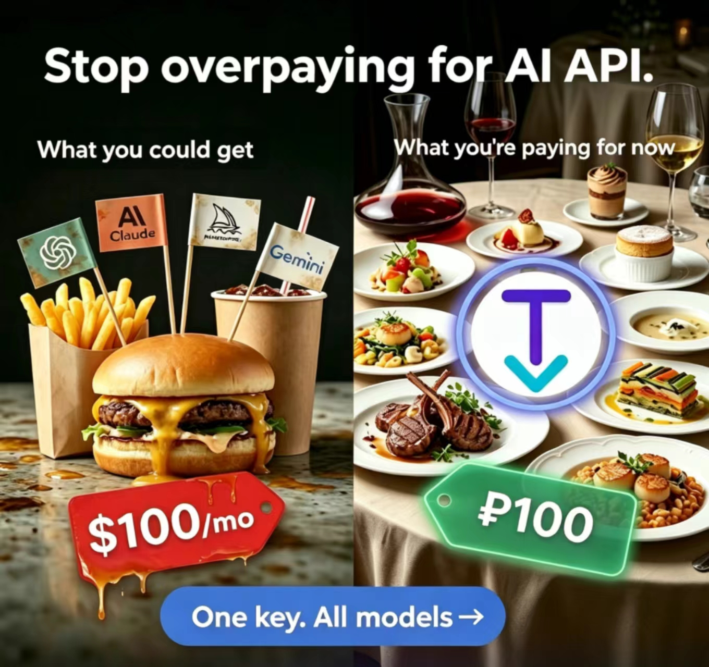

  
  <h1>TokenOff</h1>

  

[Docs (EN)](https://tokenoff.com/en/docs/) | [文档 (中文)](https://tokenoff.com/zh/docs/) | [Документация (RU)](https://tokenoff.com/ru/docs/)

## Features

- **Multi-model support** — Claude, OpenAI, and Gemini model families, all under one roof
- **One API key** — a single key grants access to all supported models
- **Drop-in compatible** — fully compatible with the official API schema; just swap the base URL
- **Works everywhere** — Terminal, VS Code, Xcode, Android Studio, and any IDE or tool that supports custom API endpoints
- **Flexible access** — use via REST API or Agent SDK, exactly as you would with the official providers
- **Better pricing** — pay less for the same models

## Quick Start

1. Get your API key at [tokenoff.com](https://tokenoff.com/api-keys)
2. Set the base URL to `https://tokenoff.com/api`
3. Use your existing code — no other changes needed

## Documentation

Full documentation is available.

- [English](https://tokenoff.com/en/docs/)
- [中文](https://tokenoff.com/zh/docs/)
- [Русский](https://tokenoff.com/ru/docs/)

## Feedback & Issues

Have a question, a feature request, or a use case we haven't covered? [Open an issue](https://github.com/tokenoff-ai/tokenoff/issues). We take every report seriously and ship the ones that make sense.
